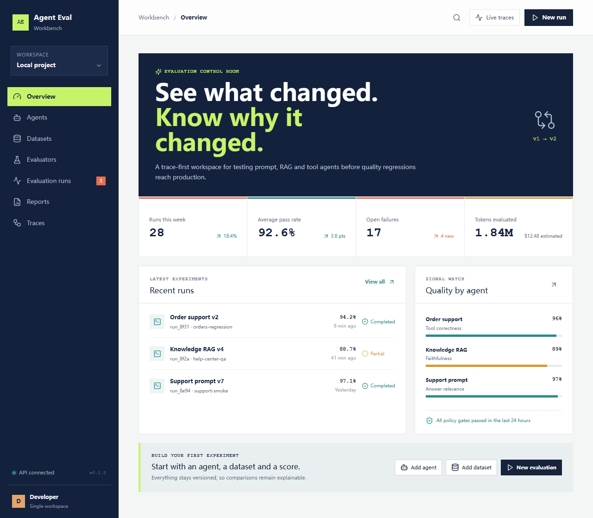
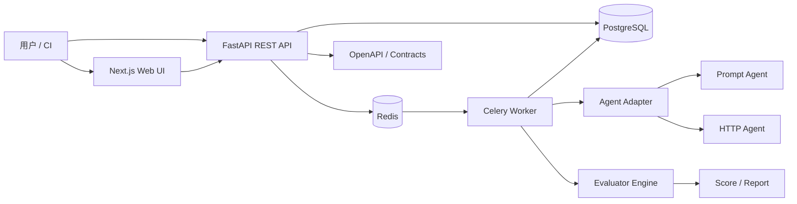
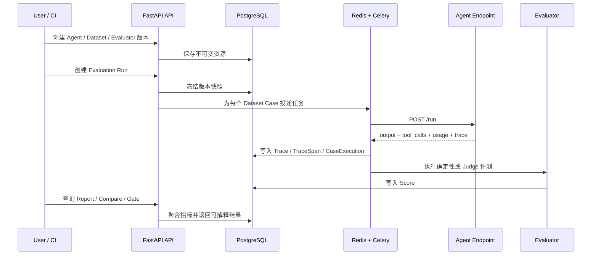
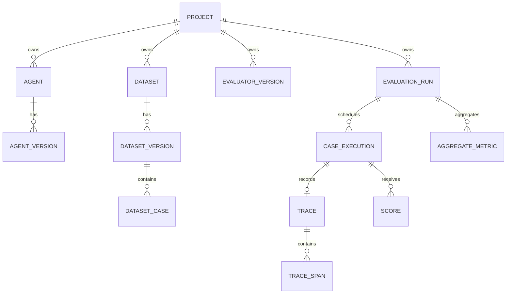

# Agent Eval Workbench

一个面向 Prompt、RAG、Tool 和 Custom Agent 的自托管可视化评测与回归分析平台。
它把 Agent、数据集、评测器和运行配置全部版本化，逐样本执行评测，保存可解释的
Trace 与 Score，并通过报告和 Regression Gate 帮助发现质量回退。

> 项目定位：一个可运行的 Agent Evaluation Workbench 原型，重点展示评测平台的
> 完整工程链路，而不是声称存在一个适用于所有 Agent 的“万能总分”。

[](https://www.python.org/)
[](https://nodejs.org/)

## 产品预览

首页工作台展示评测运行、通过率、失败样本和 Agent 质量信号：



平台中的核心工作流是：注册 Agent -> 导入版本化 Dataset -> 选择 Evaluator ->
启动 Evaluation Run -> 查看 Trace 和 Score -> 比较版本 -> 执行 Regression Gate。

## 核心能力

| 能力 | 当前实现 |
| --- | --- |
| Agent 接入 | Prompt Agent 配置、HTTP Agent `/run` 协议、Prompt/RAG/Tool/Custom 类型 |
| Dataset | 手动录入、CSV/JSON/JSONL 导入、字段映射、预览校验、不可变版本 |
| Evaluator | 确定性评测器、LLM Judge 边界、第三方适配器能力合同 |
| 执行引擎 | Celery + Redis 异步逐 case 执行，单样本失败隔离、重试和取消 |
| 可观测性 | Canonical Trace/TraceSpan，记录 prompt、LLM、retrieval、tool、guardrail 等步骤 |
| 报告 | 指标聚合、失败样本、Score evidence、Trace timeline、CSV/JSON 导出 |
| 回归分析 | Baseline/Candidate 运行比较、新失败/恢复样本、Regression Gate |
| 工程质量 | OpenAPI 合同、Alembic 迁移、pytest、Playwright E2E、Ruff、mypy、CI |

## 评测模型

平台不强行合成一个总分，而是将不同维度分别报告：

- **任务成功**：目标状态、结构化输出或业务结果是否满足预期。
- **答案质量**：相关性、正确性、忠实性等可由 Judge 或 RAG 评测器计算。
- **Tool 行为**：工具名称、参数和调用顺序是否正确。
- **安全与策略**：策略合规、JSON Schema、拒答等确定性门禁。
- **效率成本**：延迟、Token 用量和估算成本。
- **回归信号**：候选版本相对基线是否出现新失败或指标下降。

Score 有明确状态：`passed`、`failed`、`missing`、`error`、`not_run`。缺失或评测器
错误不会被静默当作通过。

## 系统架构



### 关键数据链路



### 持久化模型



运行开始时会冻结 Agent、Dataset、Evaluator、Prompt、模型和采样参数快照，确保历史
报告在资源后续修改后仍然可解释。

## 技术栈

| 层 | 技术 |
| --- | --- |
| Web | Next.js 16、React 19、TypeScript、Tailwind CSS、Recharts、Lucide React |
| API | Python 3.12、FastAPI、Uvicorn、Pydantic Settings、HTTPX |
| 数据访问 | SQLAlchemy 2、Alembic、PostgreSQL 16；测试可使用 SQLite |
| 异步任务 | Celery 5、Redis 7 |
| 工程工具 | pytest、Playwright、Ruff、mypy、Docker Compose、GitHub Actions |

## 快速开始

### 环境要求

- Docker Desktop 和 Compose v2
- 若不使用容器：Python 3.12、Node.js 22、npm

### 启动完整演示环境

```powershell
if (!(Test-Path .env)) { Copy-Item .env.example .env }
docker compose -f infra/docker-compose.yml up -d --build --wait
```

Compose 会自动读取根目录的 `.env`。`.env` 只用于本地运行，已被 Git 忽略；
GitHub 中保留的是 `.env.example`。

访问：

- Web UI：http://127.0.0.1:3000
- API：http://127.0.0.1:8000
- Swagger：http://127.0.0.1:8000/docs
- 示例 Prompt Agent：http://127.0.0.1:8101/docs
- 示例 RAG Agent：http://127.0.0.1:8102/docs
- 示例 Order Tool Agent：http://127.0.0.1:8103/docs

API 和 Worker 启动前会执行 Alembic migration，并由 API 自动创建本地 `project-1`。
Compose 使用 PostgreSQL volume 保存演示数据。

### 运行版本回归 Demo

推荐在 API 容器内执行 Demo。这样容器可以直接读取 `.env` 中的 session secret，
同时可以通过 Compose 服务名访问示例 Agent：

```powershell
docker compose -f infra/docker-compose.yml exec -T api sh -c 'python examples/seed_regression_demo.py --api-url http://127.0.0.1:8000 --workspace-session "dev:project-1:$WORKSPACE_SESSION_SECRET" --agent-url http://order-agent:8103/run'
```

Demo 会创建 Dataset v1/v2、基线与候选 Tool Agent、确定性 Evaluator、两次运行、
版本比较以及一个刻意失败的 Regression Gate。

## Agent 如何接入

平台不执行用户上传的 Agent 源码。接入方式有两种：

1. **Prompt Agent**：在 UI/API 中保存 OpenAI-compatible endpoint、prompt template、
   model 和采样参数，由平台的 Prompt Runner 发起调用。
2. **HTTP Agent**：用户自行部署 Agent，平台通过 HTTP `POST /run` 调用。容器网络中
   必须使用可达地址，例如 `http://order-agent:8103/run`，不能在 API 容器中使用
   `localhost` 指向用户电脑。

HTTP 请求与响应示例：

```json
{
  "input": "Cancel order 42",
  "variables": {},
  "messages": [],
  "metadata": {"run_id": "...", "case_id": "..."},
  "trace_id": "..."
}
```

```json
{
  "output": {"status": "cancelled"},
  "tool_calls": [{"name": "search_order", "arguments": {"order_id": "42"}, "order": 0}],
  "usage": {"input_tokens": 20, "output_tokens": 8, "cost": 0.001},
  "trace": {"trace_id": "...", "spans": []}
}
```

## 数据集格式

CSV、JSON 和 JSONL 最终都会映射到统一的 Dataset Case：

| 字段 | 用途 |
| --- | --- |
| `id` | 稳定且唯一的 case 标识 |
| `input` | 发给 Agent 的文本或结构化输入 |
| `variables` / `messages` | Prompt 变量和多轮上下文 |
| `expected_output` | 参考答案或结构化结果 |
| `output_schema` | 结构化输出 JSON Schema |
| `criteria` | 自然语言评测标准 |
| `expected_tools` / `expected_state` | Tool 调用和业务状态期望 |
| `retrieval_context` | RAG 忠实性/上下文相关性参考资料 |
| `metadata` | 标签、难度、分类等分组信息 |

CSV 中的嵌套字段应保存为合法 JSON；包含多轮消息、工具或 retrieval context 时，
推荐使用 JSONL。

## 目录结构

```text
apps/
  web/       Next.js 工作台
  api/       FastAPI 路由、领域服务和数据访问
  worker/    Celery 任务与评测执行器
examples/    Prompt、RAG、Tool Agent 和回归 Demo
packages/
  contracts/ OpenAPI 与共享合同
migrations/  Alembic 数据库迁移
tests/       unit / integration 测试
infra/       Docker Compose 拓扑
docs/        使用、架构和运维文档
```

## 本地开发与验证

```powershell
pip install -e ".[dev]"
python -m pytest tests/unit tests/integration
python -m ruff check apps/api apps/worker examples tests
python -m mypy apps/api apps/worker examples

Push-Location apps/web
npm ci
npm run typecheck
npm run build
npm run test:e2e
Pop-Location
```

Playwright E2E 在浏览器边界 mock API，不要求本地 Docker；Compose health job 会额外
验证容器、PostgreSQL、Redis、migration 和示例 Agent。

若只在宿主机运行 Web 开发服务器，请先执行 `Copy-Item apps/web/.env.example
apps/web/.env.local`，并确保 API 已在 `8000` 端口运行。

## 安全与隐私

- 不要提交 `.env`、API key、数据库文件、日志、抓取结果或构建产物。
- `.env.example` 只包含不可用的占位符；生产环境必须使用随机生成的密钥。
- Agent 的 HTTP credential 和 LLM key 只作为 secret 配置，不应写入 Trace。
- Trace 字段按敏感字段名脱敏，并限制单字段大小。
- 每个 project-scoped API 都执行项目边界检查；浏览器 session 和项目 API key 分离。
- 发布前执行 `git diff --cached` 和仓库密钥扫描；若密钥曾进入 Git 历史，仅删除文件是不够的，必须轮换密钥并清理历史。

发布前建议安装并运行 `gitleaks`：

```powershell
gitleaks detect --source . --no-banner --redact
```

## 文档

- [使用指南](docs/usage.md)
- [架构与取舍](docs/architecture.md)
- [运维指南](docs/operations.md)
